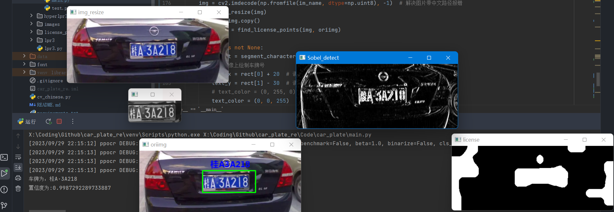
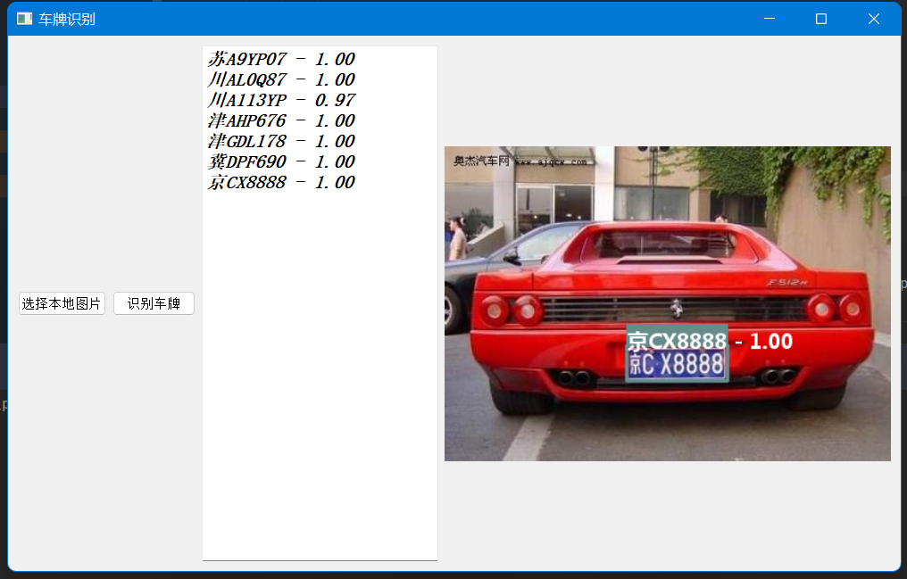
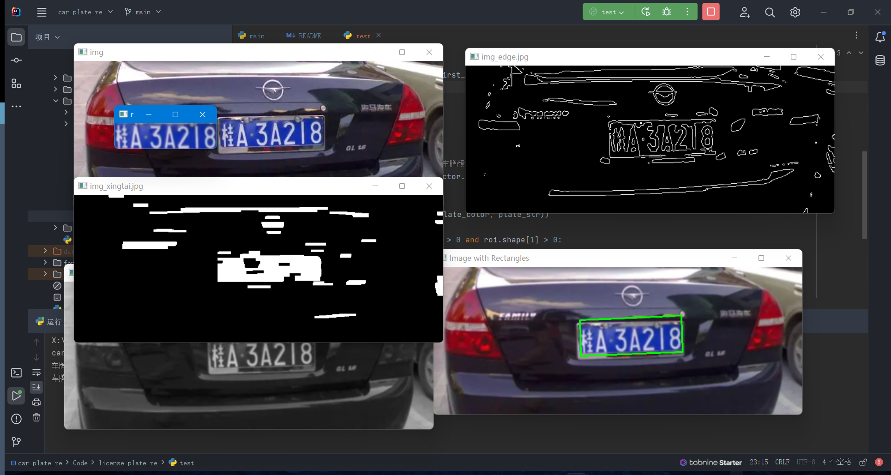
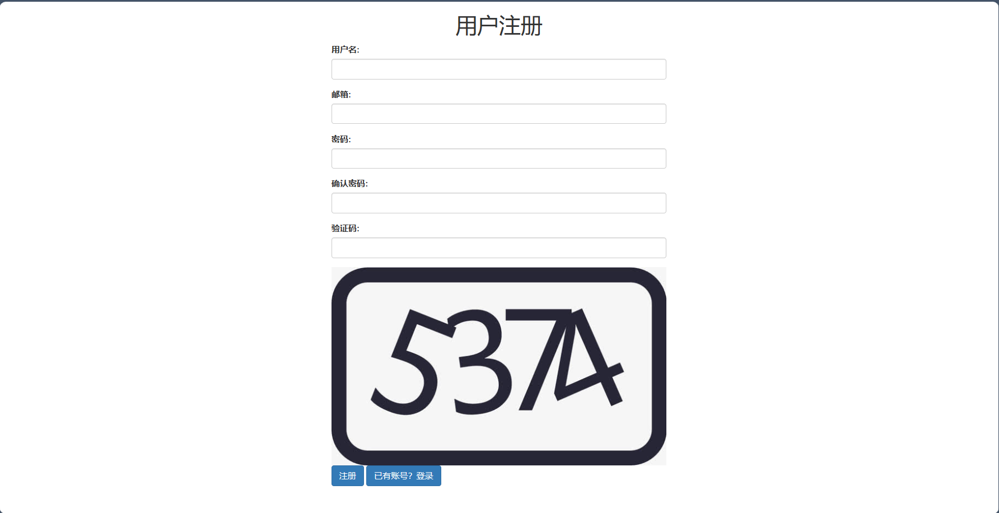
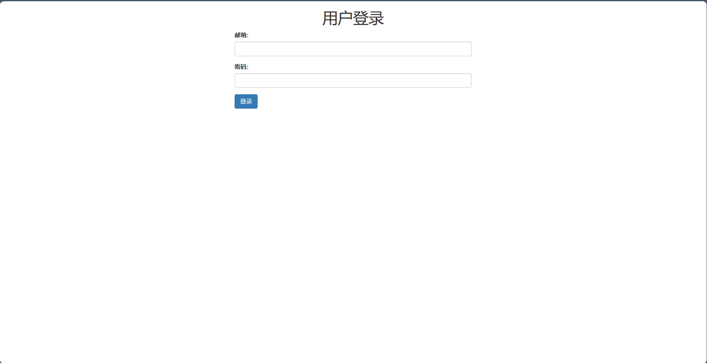
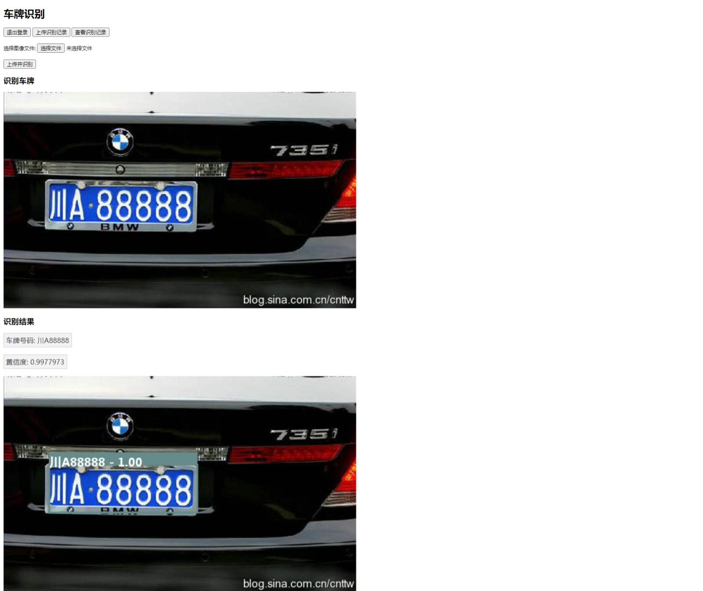
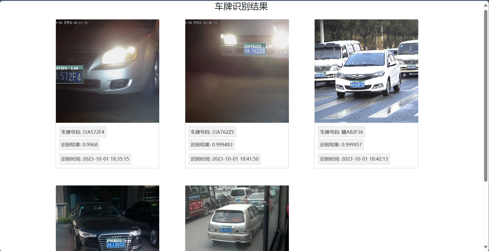

# car_plate_re

车牌识别

**Fxx**

--------------------------------

部分车牌图片来源于网络，侵删

# 目录

- [CODE车牌识别](#简单车牌识别模型训练)
- [car_plate](#carplate)
- [lpr3](#lpr3)
- [license_plate_re](#licenseplatere)
- [flask+car_plate_re]()

----------------------------------------------------------

1. 三种车牌识别，代码放在Code文件夹下
2. 然后根据flask写了一个网页来展示和调用车牌识别
3. 采用flask+css等一些前端的东西，数据库采用mysql,用python的pymysql库来操作
4. 把识别数据写入数据库，然后一些展示
5. 前端css没怎么写，页面美化在本项目中不是重点
6. 美化可选择bootstrap

----------------------------------------------------------

## hyperlpr3库

[仓库连接](https://github.com/szad670401/HyperLPR)

- opencv-python (>3.3)
- onnxruntime (>1.8.1)
- fastapi (0.92.0)
- uvicorn (0.20.0)
- loguru (0.6.0)
- python-multipart
- tqdm
- requests

```bash
raise ValueError(
ValueError: This ORT build has ['AzureExecutionProvider', 'CPUExecutionProvider'] enabled. Since ORT 1.9, you are
required to explicitly set the providers parameter when instantiating InferenceSession. For example,
onnxruntime.InferenceSession(..., providers=['AzureExecutionProvider', 'CPUExecutionProvider'], ...)
```

> 当onnxruntime版本较新的时候，我发现运行报错,所有我装的是1.8.1


--------------------------------------------------

## 简单车牌识别模型训练

> 标注工具使用VGG Image Annotator (VIA)，就是一个网页程序，可以导入图片，使用多边形标注，标注好了以后，导出json

- Code lpr3代码部分
- data **未上传**
    - ann 用于字符识别的数据集，包含分隔好的单个车牌汉子、字母和数字
    - carplate 用于车牌定位的数据集，要收集250张车辆图片，200张用于训练，50张用于测试，然后在这些图片上标注出车牌区域
- .gitignore 忽略上传到git的文件夹
- font 中文字体

-------------------------------------------------------------------------

1. Code中，car_plate下实现了简单的车牌识别
    1. 但经过测试，效果不是很好
    2. 一个是车牌定位不准确，很可能识别不到车牌
    3. 识别到的车牌正确率还算挺好
2. hyperlpr3是来自github hyperlpr3仓库中python代码
    1. 经过学习和大致了解
    2. [Hyperlpr3中文文档说明](./Code/hyperlpr3/README_CH.md)
3. lpr3文件夹下是导入lpr3库的一个车牌识别的测试和UI界面
    1. 支持从文件中选择图片，包括带中文路径的图片
    2. 选择之后可以车牌识别，并把识别结果显示在窗口上
4. license_plate_re:
    1. 基于openCV的SVM模型预测车牌,图像处理图像分割解析字符

-------------------------------------------------------------------------------

## 效果图

### car_plate

    



### lpr3



### license_plate_re

  


## myapp

### 项目结构

- *static*
    - 存放一些文件，比如css、js、images
- *templates*
    - flask的模板文件夹,里面放html文件
- *app.py*
    - 路由
- *config.py*
    - 配置文件
- *requirements.txt*
    - 依赖
- *run.py*
    - 运行
- *sql_car.py*
    - 一些关于数据库操作的方法我放在里面了

### 运行图

> 选择文件->上传并识别  
> 可选择上传识别记录以及查看记录  
> 图片采用保存在本地，放数据库不太方便  
> 在static下的re_image下，会根据用户邮箱创建一个邮箱的文件夹，然后里面放该用户的识别图片  
> re_image文件夹未上传到github   
> 其实图片想放在图床来着，但是就这样吧

  
  
  
  